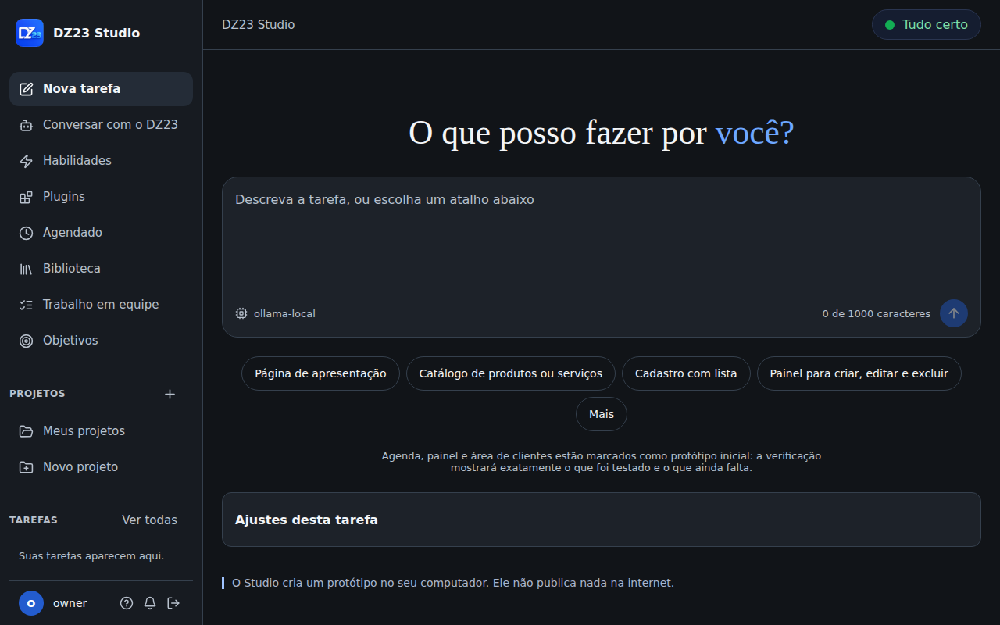
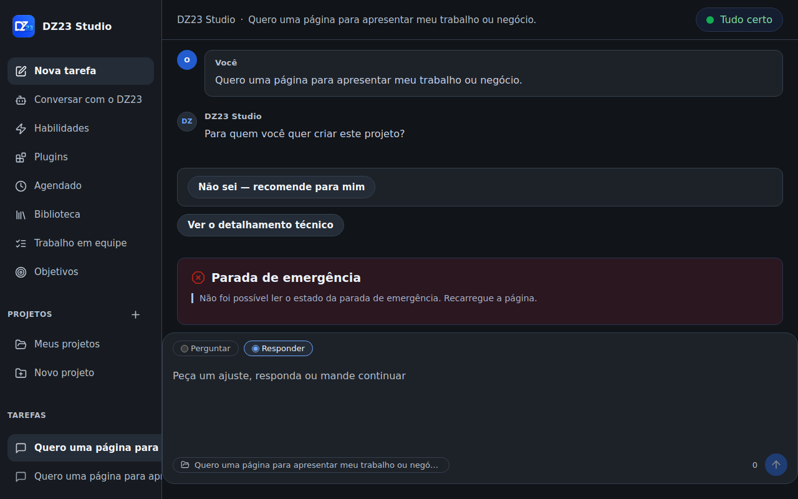
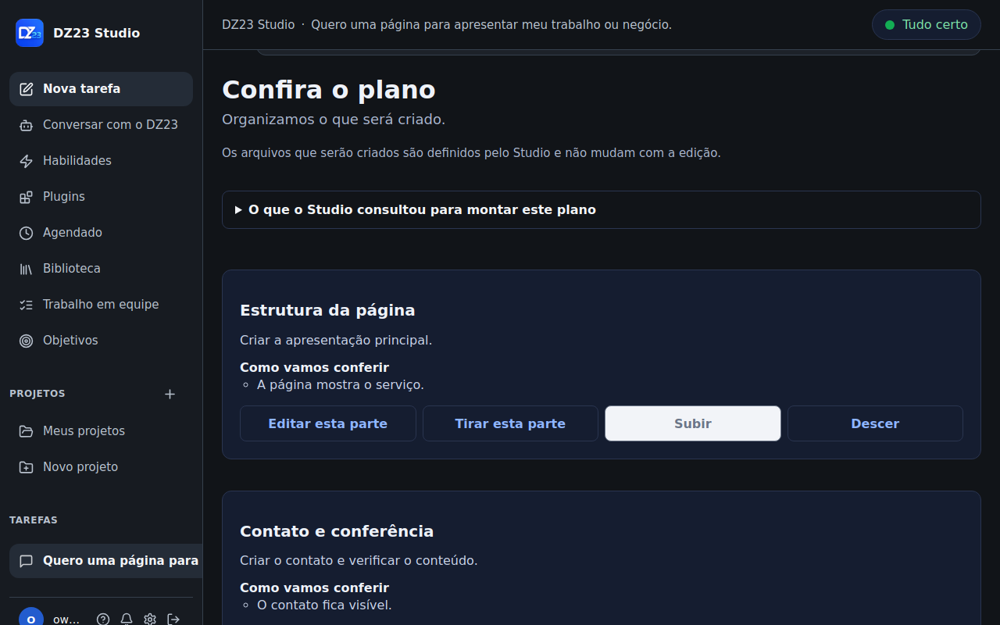
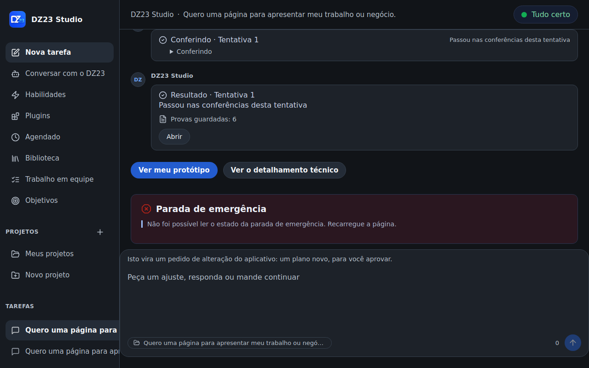
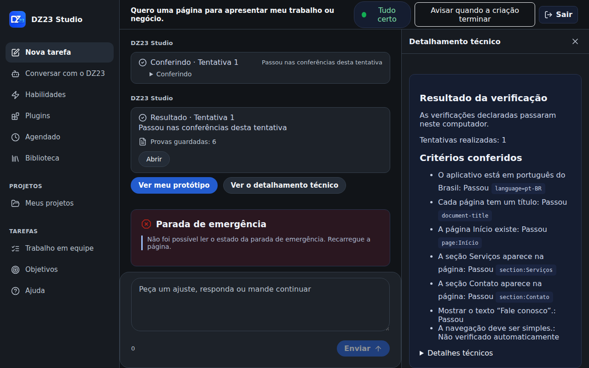
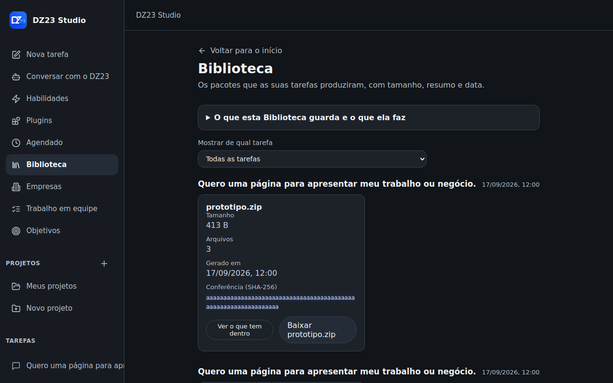
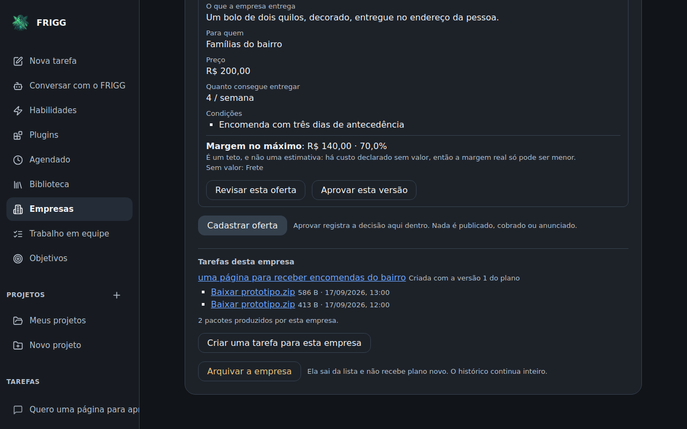
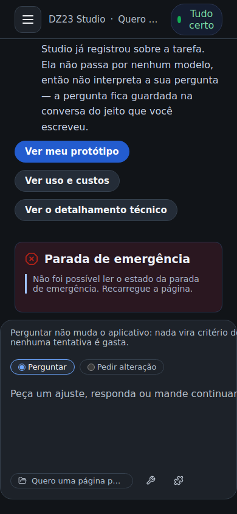
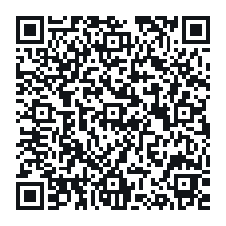

<div align="center">

# FRIGG

**Descreva o aplicativo que você precisa. Com as suas palavras.**

Um produto de código aberto que transforma uma ideia escrita por quem **não programa**
em um aplicativo real — planejado, construído e conferido no seu próprio computador.

Construído **sobre** o [DeepSeek Harness](https://github.com/deepseek-ai/deepseek-harness),
sem alterar uma linha dele.

[](./LICENSE)
[](./docs/guides)
[](./docs/MASTER_REQUIREMENTS_LEDGER.md)



</div>

---

## O que é

A maioria das ferramentas de "IA que programa" foi feita para quem programa. Elas
pedem um *prompt*, devolvem código, e quando algo dá errado mostram um *stack
trace*. O FRIGG parte de outro lugar: **a pessoa que precisa do aplicativo
não sabe, e não precisa saber, o que é um build**.

Você entra e há **uma coisa a fazer**: dizer o que precisa. O tipo, a aparência
e a privacidade ficam à mão, um nível abaixo, em "Ajustes desta tarefa" — porque
a home que cobra sete decisões antes da primeira palavra não é uma home, é um
formulário.

A partir daí **a tarefa é uma conversa** (ADR-051), e não um assistente de cinco
telas: a pergunta chega como um lance, a resposta vai pelo mesmo compositor de
baixo, e continuar a tarefa depois é escrever no mesmo lugar. As cinco etapas
continuam existindo — elas são o que acontece —, mas ninguém precisa navegar
entre telas para atravessá-las:

| | etapa | o que acontece |
|---|---|---|
| 1 | **Ideia** | Você escreve o que precisa. O FRIGG adivinha o tipo de aplicativo pelo texto — e **diz quando não entendeu**, em vez de fingir. |
| 2 | **Perguntas** | Uma pergunta por vez, sem termo técnico. Dado sensível (CPF, saúde, dados de crianças) é apontado e você decide. |
| 3 | **Plano** | O que será criado, em partes que você pode aprovar, editar, remover ou reordenar. **Nada é construído antes da sua aprovação.** |
| 4 | **Criação** | O aplicativo é gerado e construído em um contêiner **sem rede**, sistema de arquivos somente leitura e nenhuma permissão de sistema. |
| 5 | **Verificação** | Os critérios que você aprovou são conferidos um a um, com o resultado de cada um — e o que **não** foi verificado aparece dizendo isso. |

<table>
<tr>
<td width="50%"></td>
<td width="50%"></td>
</tr>
<tr>
<td width="50%"></td>
<td width="50%"></td>
</tr>
</table>

Durante a criação o FRIGG mostra os **passos do construtor** enquanto eles
acontecem: o que já terminou, com o tempo que levou; o que está em andamento; e
o que ainda vai acontecer. Numa tela onde nada muda, "trabalhando" e "travado"
têm a mesma aparência — e quem não programa não tem como distinguir os dois.

O estado nunca é só cor: a palavra fica ao lado do ponto, porque
verde-e-vermelho desaparece para quem não distingue os dois.

E você volta para qualquer tarefa quando quiser, pelo trilho da esquerda — a
situação de cada uma aparece em palavras, nunca como código de máquina.

### Sete tipos de aplicativo

Página de apresentação · Catálogo de produtos ou serviços · Cadastro com lista ·
Painel para criar, editar e excluir · Agenda de horários · Painel de acompanhamento
(só leitura) · Área com acesso separado por cliente.

O que sai é um projeto **Next.js** de verdade, com banco SQLite, acesso por código
de e-mail, telas de cadastro e o que mais a categoria exigir — e você pode baixar
o pacote inteiro e levar para onde quiser.

---

## O que este projeto acrescenta ao DeepSeek Harness

O DeepSeek Harness é o núcleo de orquestração de agentes. Ele é excelente nisso e
**não foi tocado**: o submódulo está fixado no commit
`6c705be1ce6774a000d061da41d1823b03a3d42c`, e um portão de integração contínua
reprova qualquer alteração nele. Tudo abaixo foi construído **por composição**,
usando as costuras públicas do Harness.

### 1. Uma jornada para quem não programa
O Harness fala com quem escreve código. O `prompt-to-app` acrescenta a jornada
completa Ideia → Perguntas → Plano → Criação → Verificação, sete categorias de
aplicativo, geração de projeto Next.js com camada de dados, autenticação sem
senha, painéis CRUD, agenda e painéis de acompanhamento. Tudo em português do
Brasil, com um portão que **reprova texto solto no código**.

### 2. Plano de confiança: identidade, inquilinos e níveis
Identidade com *passkey* e código por e-mail, sessões opacas e **revogáveis de
verdade** (sair encerra a sessão no servidor, não só no navegador), organizações
e espaços de trabalho com papéis, e uma política de níveis **T0–T3** em que ação
sensível exige confirmação explícita e, no nível mais alto, *passkey* recente na
mesma sessão.

### 3. Autoridade de confirmação ligada à costura do Harness
Quando o Harness pergunta "posso fazer isso?", quem responde é uma autoridade
durável do Studio — com pedido descrito em português, impressão digital que
impede dois pedidos diferentes de parecerem iguais, e consumo **uma única vez**
por execução. Sem rota pública de criação, e sem ninguém fabricando `approved:
true`.

### 4. Construção isolada de verdade
O aplicativo gerado é construído em contêiner com `NetworkMode: none`, raiz
somente leitura, **todas** as capacidades derrubadas, sem privilégio e sem portas
publicadas. E existe uma prova executável que **sabota o próprio produto** para
confirmar que a proteção reprova quando enfraquecida — não basta o código dizer
que está seguro.

### 5. Armazenamento com isolamento no banco, não no código
Backend PostgreSQL 16 para os domínios do Studio, com escritor único por unidade,
cópia de segurança fora do processo, restauração com diário atômico que recusa
cópia vazia, parcial ou de outra instalação. Dois domínios já saíram da
chave-valor opaca para **tabela por inquilino com RLS forçada** — onde é o
PostgreSQL que recusa o que não é do inquilino, e não um `if` do produto. Um
portão mede a distância que falta e **só deixa esse número diminuir**.

### 6. Prévia segura e Hub de integrações
Prévia por host próprio, com código de admissão, sem herdar sessão. Integrações
registradas por **manifesto assinado (Ed25519)**, com nível mínimo por natureza
da permissão, desligamento por alcance e recusa auditada.

### 7. Roteamento de modelo com perfil de privacidade
Rotas local (Ollama), OmniRoute e provedor oficial, com um perfil
**"privado-local"** em que a criação simplesmente não acontece se a rota local
não estiver disponível — em vez de cair silenciosamente para um provedor externo.

### 8. Interface instalável e acessível, no tema grafite, em três idiomas
PWA instalável, quatro tamanhos de tela testados (mesa, tablet, celular e a faixa
de 900px), varredura de acessibilidade **axe no fluxo inteiro**, e botões que
avisam que estão trabalhando em vez de deixar a pessoa clicando duas vezes.

O tema grafite é o **padrão** do produto, e não uma preferência do sistema: é a
direção visual aprovada pelo proprietário (ADR-050). Abaixo de 1024px a
navegação vira gaveta — com botão de fechar visível, `Escape`, toque fora e o
foco devolvido ao botão que a abriu.

A interface tem **português do Brasil, inglês e espanhol** (ADR-053), com
seleção em Preferências, negociação pelo idioma do navegador e persistência.
Trocar de idioma não muda moeda, preço, permissões, tarefas, histórico nem o
horário dos agendamentos. **A cobertura ainda é parcial** — navegação e
Preferências —, e a própria tela diz isso nos três idiomas em vez de fingir o
contrário.

<table>
<tr>
<td width="50%"></td>
<td width="50%"></td>
</tr>
</table>

### 9. Uma cultura de prova que é parte do produto
Este é, talvez, o acréscimo mais incomum. O repositório trata **evidência** como
código:

- **`docs/MASTER_REQUIREMENTS_LEDGER.md`** — uma linha por requisito, com estado
  verdadeiro (`STABLE`, `BETA`, `NOT_EXECUTED`, `FAILED`…). **Nenhuma linha usa
  "pronto" ou "funciona".** Onde só existe teste sobre dado simulado, o estado é
  `NOT_EXECUTED`, não `BETA`.
- **30 portões e 22 provas** (`pnpm gate:*`, `pnpm prove:*`), quase todos com
  *self-test* que sabota o próprio portão para confirmar que ele reprova.
- **`audit/`** — quatro rodadas de auditoria independente por agentes que
  **atacam** o código: refazem mutações, escrevem testes próprios e usam o
  produto no navegador. As três primeiras acharam defeitos críticos que os testes
  do autor não pegaram, e isso está escrito lá.

---

## Estado, sem maquiagem

**Versão 1.0 candidata.** O que está provado, está provado aqui — e o que não
está, tem o motivo escrito.

| | |
|---|---|
| suíte de unidade e integração | **4.049 testes** (228 arquivos) |
| interface | **881 testes** |
| navegador (Chromium real) | **160 testes** em 4 tamanhos, com varredura axe |
| PostgreSQL 16 real | **65/65** em banco de verdade |
| portões estáticos | **30/30** |
| diff no Harness | **zero** |

Os números acima são de uma execução completa das quatro suítes, e não de uma
estimativa. `docs/OPERACAO.md` tem o comando de cada uma; `gate:typecheck` e
`gate:lib-freshness` existem porque os dois passos que dava para pular foram
pulados.

**O que ainda não aconteceu, e é honesto dizer:**

- **Nenhuma pessoa leiga usou o produto ainda.** Ele existe para quem não
  programa e nunca foi visto por alguém assim. É o requisito `U-04`.
- Nenhum *deploy* de produção. O destino de publicação hoje é **local**.
- A imagem OCI ainda não foi construída (falta rota de rede para registro de
  pacotes no ambiente de build).
- **Nenhum modelo de verdade escreveu um aplicativo aqui.** O caminho inteiro é
  provado contra dobro. Há uma medição com Ollama real registrada em `EB-04`: o
  código que um modelo pequeno devolveu **passa** nas guardas, mas o prompt real
  não completa em tempo utilizável em CPU.
- **178 dos 287 requisitos estão em `BETA`**: construídos e provados **neste
  ambiente**, não na vida real. 69 estão em `STABLE`, e o resto tem o motivo
  escrito, um por um.

A lista completa, com bloqueio e próximo passo de cada um, está no
[livro-razão de requisitos](./docs/MASTER_REQUIREMENTS_LEDGER.md) e na
[matriz de capacidades](./docs/CAPABILITY_MATRIX.md).

---

## Para quem vai mexer no código

[`CLAUDE.md`](./CLAUDE.md) é o ponto de entrada de qualquer agente de IA neste
repositório — ordem de leitura, regras que não se negociam e a disciplina que
produziu o que está aqui. [`docs/OPERACAO.md`](./docs/OPERACAO.md) tem os
comandos: cada portão, cada suíte, e o roteiro de falsificação.

## Instalação

> **Não é um aplicativo de desktop.** Não há `.exe` nem `.dmg`. O FRIGG é
> um servidor que roda no seu computador e abre no navegador — e o navegador
> instala a interface como aplicativo (PWA), que é o mais perto de um ícone na
> área de trabalho.

> **Com pressa?** [`docs/COMECAR.md`](./docs/COMECAR.md) é o caminho curto: do
> zero ao primeiro aplicativo, em uma página. Se algo faltar, `pnpm studio:doctor`
> diz em português o que é e o comando exato que resolve — um de cada vez, e
> nunca um *stack trace*.

### Para desenvolver

Requisitos: Node.js `22.23.1`, pnpm `11.7.0`, Git com submódulos e *symlinks*.
No Windows, WSL2 com o clone em `ext4` (`~/...`, nunca `/mnt/c`).

```bash
git clone --recurse-submodules https://github.com/LMPrado-DZ23/deepseek-harness-evoluido
cd deepseek-harness-evoluido
```

### Primeiro uso em um clone novo

Esta é a sequência EXATA que a CI executa num clone limpo, na ordem em que ela
executa. A ordem não é preferência: o Harness fixado precisa ser instalado e
compilado antes do Studio, e o filtro `'@dz23-studio/*...'` instala só o que o
workspace declara — por isso um pacote importado e não declarado passa na
máquina de quem desenvolve e reprova aqui.

```sh
node scripts/bootstrap-upstream.mjs
node scripts/check-upstream-content.mjs
pnpm --dir third_party/deepseek-harness install --frozen-lockfile
pnpm --dir third_party/deepseek-harness build:official
pnpm install --frozen-lockfile --filter '@dz23-studio/*...'
pnpm build
pnpm typecheck
pnpm exec vitest run --maxWorkers=1
```

`tests/portability/clean-clone-readme.test.mjs` compara este bloco com a
sequência da CI. Se um dos dois mudar sem o outro, ele reprova — que é o ponto:
um README que descreve uma instalação que ninguém executa é pior que nenhum.

```bash
pnpm studio:doctor   # confere o ambiente e diz o que falta, um passo por vez
pnpm studio          # sobe o FRIGG; o endereço aparece no terminal
```

O procedimento completo e a ordem obrigatória estão em
**[`docs/BOOTSTRAP.md`](./docs/BOOTSTRAP.md)** — a ordem importa: o Harness
fixado precisa ser instalado e compilado antes do Studio.

### Para usar no Windows 11

Scripts em [`deploy/windows/`](./deploy/windows/) instalam dentro do WSL2 e sobem
o Studio e a borda Caddy como contêineres fixados por *digest*. Eles **não**
instalam WSL, Docker ou Git, não pedem privilégio de administrador e nunca
instalam certificado, proxy ou serviço do Windows.

```powershell
./deploy/windows/install.ps1 -SourcePath C:\caminho\studio -ExpectedCommit <sha> `
  -Image <studio@sha256:...> -CaddyImage <caddy-dz23@sha256:...> -Start
```

⚠️ **Hoje esse caminho não fecha:** o instalador exige imagens publicadas por
*digest*, e a imagem OCI ainda não foi construída (`D-10`). Quem quiser rodar
agora usa o caminho de desenvolvimento acima.

---

## Arquitetura em uma imagem

```
┌──────────────────────────────────────────────────────────────┐
│  Caddy — borda única: forward_auth, rate limit, CSP, headers │
└───────────────────────────┬──────────────────────────────────┘
                            │
┌───────────────────────────▼──────────────────────────────────┐
│  DeepSeek Harness  (submódulo FIXADO, zero diff)             │
│  ├── costuras públicas: plugins, jobs, storage, approval     │
└───────────────────────────┬──────────────────────────────────┘
                            │  composição, sem patch
┌───────────────────────────▼──────────────────────────────────┐
│  22 plugins do FRIGG                                        │
│                                                              │
│  confiança   identity · tenancy · policy · action-approval   │
│  criação     prompt-to-app · builder-supervisor · staging    │
│  execução    agents · agent-team · assistant-bridge          │
│  conexão     integration-hub · mcp-client · route-health     │
│  dados       storage-postgres · runtime-governor             │
│  entrega     preview · preview-supervisor · studio-web       │
│  segurança   emergency-stop                                  │
└───────────────────────────┬──────────────────────────────────┘
                            │
        ┌───────────────────┴────────────────────┐
        │                                        │
┌───────▼─────────┐                    ┌─────────▼──────────┐
│  apps/studio-web │                    │  contêiner de      │
│  React + PWA     │                    │  construção        │
│  português       │                    │  SEM REDE          │
└──────────────────┘                    └────────────────────┘
```

As decisões estão registradas em **58 ADRs** em [`docs/adr/`](./docs/adr/).

<div align="center">

</div>

---

## Apoiar o projeto

O FRIGG é de graça e continua sendo. Isto aqui é **doação voluntária** — de valor
livre, sem contrapartida, sem plano e sem nada destravado por ela. Se o projeto
te serviu e você quiser ajudar a mantê-lo, obrigado.

<table>
<tr>
<td width="220" align="center">
<br>
<sub>Aponte a câmera do<br>seu banco</sub>
</td>
<td>

**PIX copia e cola** — o botão de copiar fica no canto do bloco:

```
00020126430014br.gov.bcb.pix0121picpay@lmprado.cim.br5204000053039865802BR5920LEANDRO MARCOS PRADO6009Sao Paulo62290525REC6AAD02EE810997651615676304CC1E
```

Chave: `picpay@lmprado.cim.br` · **LEANDRO MARCOS PRADO** · valor livre

</td>
</tr>
</table>

O código acima é gerado de `docs/pix-payload.txt`, que é a única fonte dele, e
`gate:pix` confere o CRC-16 do BR Code e que este bloco cite a fonte byte a
byte. Um caractere trocado aqui não daria erro barulhento — daria um pagamento
perdido na mão de quem quis ajudar.

---

## Contribuir

O projeto tem um jeito próprio de trabalhar, e ele está escrito:

- [`CONTRIBUTING.md`](./CONTRIBUTING.md) — como propor mudança, e a regra que
  vale mais que todas: **um portão que passa com zero itens é uma falha**.
- [`docs/PRODUCT_CONSTITUTION.md`](./docs/PRODUCT_CONSTITUTION.md) — o que o
  produto nunca faz.
- [`SECURITY.md`](./SECURITY.md) — como relatar uma vulnerabilidade.

---

## Licença e marcas

Código sob **[Apache-2.0](./LICENSE)**. A escolha está registrada na
[ADR-009](./docs/adr/ADR-009-open-source-without-billing.md) e no
[estudo C-05](./docs/plans/C-05-decisao-de-licenca.md): a concessão explícita de
patente importa porque este projeto **gera aplicativos para terceiros**.

As marcas "FRIGG" e "DZ23" e os logotipos **não** são licenciados pela
licença do software — veja [`TRADEMARKS.md`](./TRADEMARKS.md). Versões
modificadas devem circular com outro nome.

O FRIGG **não tem pedágio**: nenhuma funcionalidade fica atrás de pagamento, não
há limite, cota, marca d'água, tela de upgrade nem pedido de pagamento no
caminho de quem só quer usar o produto (ADR-009, alterada pela ADR-054). O teste
é de uma linha: **nunca ter doado não muda nada do que a sua instalação faz.**

---

<div align="center">
<sub>

FRIGG é um produto da **LEANDRO MARCOS PRADO LTDA** (DZ23), Brasília, Brasil.<br>
DeepSeek Harness é um projeto da DeepSeek e é usado aqui **sem modificação**, pelas suas costuras públicas.

</sub>
</div>
